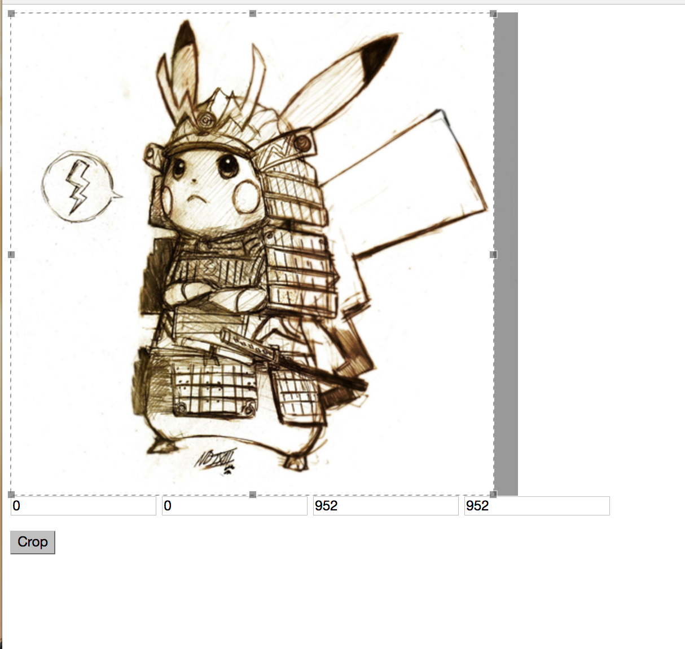
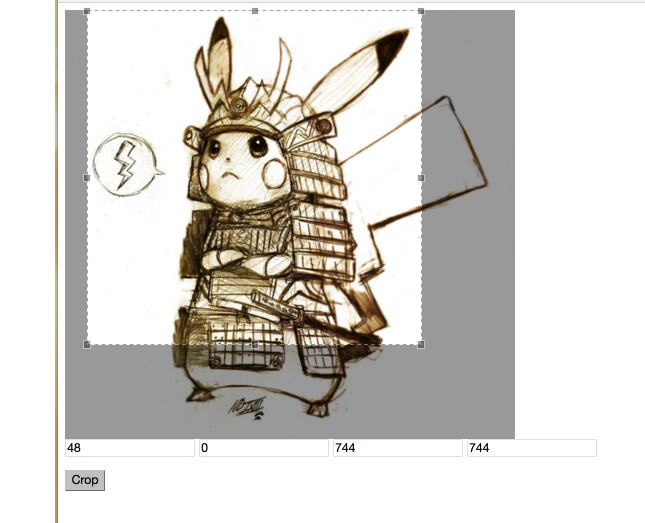
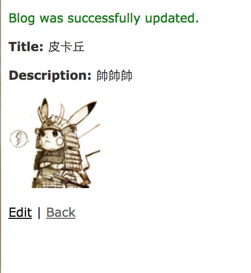

# 裁剪圖片

paperclip + Jcrop實作上傳後裁剪圖片，使用rails4實作，照著筆記的邏輯若有需要應該可以無痛實作在rails 5的專案上。

這篇是改寫自下面兩篇
- [awijeet/Image_cropping_in_rails4 GitHub](https://github.com/awijeet/Image_cropping_in_rails4)
- [Cropping an Image in Rails using Paperclip – OnGraph Technologies](http://www.ongraph.com/blog/cropping-image-in-rails-using-paperclip/)

原始筆記紀錄於專案的`wiki`資料夾，[GitHub wiki](https://github.com/NickWarm/rails_paperclip_jcrop_WG/wiki)也會記錄一份方便日後辜狗。

畫面如下

