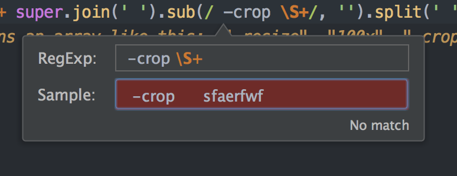
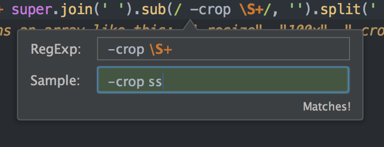

# 逆向工程：Image_cropping_in_rails4 - GitHub

最初研究這則範例
- [awijeet/Image_cropping_in_rails4 GitHub](https://github.com/awijeet/Image_cropping_in_rails4)

由於範例載下來後資料庫一直不明問題導致專案無法用。我照著範例寫後發現有改良的必要，於是參考下面這篇做改進
- [Cropping an Image in Rails using Paperclip – OnGraph Technologies](http://www.ongraph.com/blog/cropping-image-in-rails-using-paperclip/)


## Jcrop

GitHub
- [Manual · tapmodo/Jcrop Wiki](https://github.com/tapmodo/Jcrop/wiki/Manual)

新版官網
- [Welcome to Jcrop.org](http://jcrop.org)

>但是新版官網並沒有比較好，還一堆404連結....

舊版官網
- [Jcrop - Deep Liquid](http://deepliquid.com/content/Jcrop.html)
  - 起步走：[Jcrop Manual - Deep Liquid](http://deepliquid.com/content/Jcrop_Manual.html#Introduction)
  - API：[Jcrop API doc](http://deepliquid.com/content/Jcrop_API.html)
  - [Jcrop Sizing Issues - Deep Liquid](http://deepliquid.com/content/Jcrop_Sizing_Issues.html)


先在專案裡，加入幾個Jcrop需要的檔案
- [Image_cropping_in_rails4/app/assets/javascripts/jquery.Jcrop.js](https://github.com/awijeet/Image_cropping_in_rails4/blob/master/app/assets/javascripts/jquery.Jcrop.js)
- [Image_cropping_in_rails4/app/assets/stylesheets/jquery.Jcrop.css](https://github.com/awijeet/Image_cropping_in_rails4/blob/master/app/assets/stylesheets/jquery.Jcrop.css)
- [Image_cropping_in_rails4/app/assets/images/Jcrop.gif](https://github.com/awijeet/Image_cropping_in_rails4/blob/master/app/assets/images/Jcrop.gif)


# Paperclip設定
這篇範例要給部落格發文加上上傳圖片的功能，所以要先給他加`Paperclip gem`，然後在blog table 用`add_attachment`加上`image`欄位
- [Image_cropping_in_rails4/Gemfile](https://github.com/awijeet/Image_cropping_in_rails4/blob/master/Gemfile)
- [Image_cropping_in_rails4/db/migrate/20140605232522_add_image_to_blog.rb](https://github.com/awijeet/Image_cropping_in_rails4/blob/master/db/migrate/20140605232522_add_image_to_blog.rb)

接著我們去blog model設定Paperclip上傳的圖片規格
- [Image_cropping_in_rails4/app/models/blog.rb](https://github.com/awijeet/Image_cropping_in_rails4/blob/master/app/models/blog.rb)
先寫到這邊即可，後面的下面會解釋
```
has_attached_file :image, :styles => { :small => "100x100#", :large => "500x500>" },
                          :default_url => "/images/:style/missing.png"
```

# 裁剪時送出的表單

這範例為了加快解釋，用了scaffold去建blog，這邊把重點放在Jcrop上，不細講Paperclip。

接著我們直接來看blogs_controller的`create` action
- [Image_cropping_in_rails4/app/controllers/blogs_controller.rb](https://github.com/awijeet/Image_cropping_in_rails4/blob/master/app/controllers/blogs_controller.rb)

```
def create
  @blog = Blog.new(blog_params)
    if @blog.save
      render "cropper"
    else
      render :new
    end
end   
```

[\_form.html.erb](https://github.com/awijeet/Image_cropping_in_rails4/blob/master/app/views/blogs/_form.html.erb)送出一張表單(透過`file_field`上傳圖片)後，會轉移到[cropper.html.erb](https://github.com/awijeet/Image_cropping_in_rails4/blob/master/app/views/blogs/cropper.html.erb)頁面

一開始，我們先關注`cropper.html.erb`裡面的這張表單
- [Image_cropping_in_rails4/app/views/blogs/cropper.html.erb](Image_cropping_in_rails4/app/views/blogs/cropper.html.erb)

```
<%= image_tag @blog.image.url(:large), :id => "cropbox" %>
<%= form_for @blog do |form| %>
  <% for attribute in [:crop_x, :crop_y, :crop_w, :crop_h] %>
    <%= form.text_field attribute, :id => attribute %>
  <% end %>
  <p><%= form.submit "Crop" %></p>
<% end %>
```

我們用`image_tag`撈出剛剛上傳圖片，並給image tag的id為`cropbox`
- [rails API - image_tag](http://api.rubyonrails.org/classes/ActionView/Helpers/AssetTagHelper.html#method-i-image_tag)：我們可以看到，若想要新增`attribute`，直接用symbol指定即可。(在這邊是`:id => "cropbox"`)

由於`crooper.html.erb`仍在`create` action裡，所以`@blog`，仍是我們在`create.html.erb`送出表單後的那筆`@blog`，現在它進到`cropper.html.erb`來裁剪圖片。

接著緊接在`image_tag`後面的`form_for`

```
<%= form_for @blog do |form| %>
  <% for attribute in [:crop_x, :crop_y, :crop_w, :crop_h] %>
    <%= form.text_field attribute, :id => attribute %>
  <% end %>
  <p><%= form.submit "Crop" %></p>
<% end %>
```

我們看到在這邊用`for...in`去把一串arry裡的`:crop_x, :crop_y, :crop_w, :crop_h`這串symbols設定成input tag的id (透過`text_field`)
- [rails API - text_field](http://api.rubyonrails.org/classes/ActionView/Helpers/FormHelper.html#method-i-text_field)，請見第三個與第四個的範例
- [Action View 表單輔助方法 — Ruby on Rails 指南 - 2.1 Model 物件輔助方法](http://rails.ruby.tw/form_helpers.html#model-物件輔助方法)

```
        w
   ----------- x
  |
  |
h |
  |   
  y           (x,y)  

```


我們在`cropper.html.erb`的表單`:crop_x, :crop_y, :crop_w, :crop_h`定義好後，會有四個input tag，它們的id分別為`#crop_x, #crop_y, #crop_w, #crop_h`，現在我們要把input tag輸入的資料存入model，於是我們去`blog.rb`
- [Image_cropping_in_rails4/app/models/blog.rb](https://github.com/awijeet/Image_cropping_in_rails4/blob/master/app/models/blog.rb)

加入`attr_accessor :crop_x, :crop_y, :crop_w, :crop_h`

attr_accessor
- [Ruby 語法放大鏡之「attr_accessor 是幹嘛的?」 - 高見龍](http://kaochenlong.com/2015/03/21/attr_accessor/)
- [Ruby 當中的attr_accessor是什麼意思？ | Motion Express](http://motion-express.com/blog/20141115-ruby-attr-accessor)

在ruby有getter與setter，下面這邊用特快車的範例

```
class Car
    def color              
      @color              # getter
    end

    def color=(string)
      @color = string     # setter
    end
end
```

由於ruby常會把`return`省略掉，它其實是

```
class Car
    def color              
      return @color       # getter
    end

    def color=(string)
      @color = string     # setter
    end
end
```

如此一來我們就能調用`color`這個attribute

```
car = Car.new
car.color # nil
car.color = "blue" # blue
car.color # blue
```

注意：

`car.color = "blue"`這段，其實是`car.color = ("blue")`
- 由於Ruby可以省略`()`

此外，Ruby的神奇魔法`color =`，其實是我們上面的`def color=(string)`，透過ruby的神奇魔法，我們才能在`=`前面有空格時，依然調用這method。

為了省去設定getter、setter，才有了`attr_accessor`這寫法


在rails中我們也會用`attr_accessor`這寫法。可以創造
- [rails API - ActiveModel::Model](http://api.rubyonrails.org/classes/ActiveModel/Model.html)
- 推薦閱讀這篇comment：[ruby on rails - Difference between attr_accessor and attr_accessible - Stack Overflow](http://stackoverflow.com/a/12938809)
  - 讀了這篇我才比較有感覺，用`attr_accessor`，讓我們可以在controller中調用該attribute，在此例中是`crop_x`、 `crop_y`、`crop_w`、`crop_h`
    - [Image_cropping_in_rails4/app/models/blog.rb](https://github.com/awijeet/Image_cropping_in_rails4/blob/master/app/models/blog.rb)
    - [Image_cropping_in_rails4/blogs_controller.rb at master · awijeet/Image_cropping_in_rails4](https://github.com/awijeet/Image_cropping_in_rails4/blob/master/app/controllers/blogs_controller.rb)

## 別忘了設strong parameters

我們要送`:crop_x, :crop_y, :crop_w, :crop_h`進database，controller要記得弄strong parameters
- [Image_cropping_in_rails4/app/controllers/blogs_controller.rb](https://github.com/awijeet/Image_cropping_in_rails4/blob/master/app/controllers/blogs_controller.rb)

```
def blog_params
  params.require(:blog).permit(:title, :description, :image, :crop_x, :crop_y, :crop_w, :crop_h)
end
```

>我在實作時忘記把`:crop_x, :crop_y, :crop_w, :crop_h`加入strong parameters，結果還沒截圖就噴錯，找了好久才發現是忘記設...

# 自定義裁剪後送出的data

再來我們要修改在`blog.rb`裡的Paperclip設定
- [Image_cropping_in_rails4/app/models/blog.rb](https://github.com/awijeet/Image_cropping_in_rails4/blob/master/app/models/blog.rb)

寫成

```
class Blog < ActiveRecord::Base
  has_attached_file :image, :styles => { :small => "100x100#", :large => "500x500>" },
                    :default_url => "/images/:style/missing.png", :processors => [:cropper]
```


平常在paperclip用的`has_attached_file`就是縮圖工具Thumbnail：[paperclip wiki - Thumbnail Generation](https://github.com/thoughtbot/paperclip/wiki/Thumbnail-Generation)

由於我們要自定義裁剪的方式，所以我們建了[cropper.rb](https://github.com/awijeet/Image_cropping_in_rails4/blob/master/lib/paperclip_processors/cropper.rb)
- [paperclip wiki - Custom Attachment Processors](https://github.com/thoughtbot/paperclip#custom-attachment-processors)

然後在`blog.rb`的paperclip設定用自定義的`cropper.rb`來處理縮圖。(`:processors => [:cropper]`)


[Image_cropping_in_rails4/lib/paperclip_processors/cropper.rb](https://github.com/awijeet/Image_cropping_in_rails4/blob/master/lib/paperclip_processors/cropper.rb)

參考[paperclip wiki - Custom Attachment Processors](https://github.com/thoughtbot/paperclip#custom-attachment-processors)的寫法

`module Paperclip`包好後，裡面定義一個`Cropper` class 來繼承`Thumbnail`
- [paperclip/lib/paperclip/processor.rb](https://github.com/thoughtbot/paperclip/blob/master/lib/paperclip/processor.rb)

```
module Paperclip
  class Cropper < Thumbnail
    def transformation_command
        if crop_command
           crop_command + super.join(' ').sub(/ -crop \S+/, '').split(' ') # super returns an array like this: ["-resize", "100x", "-crop", "100x100+0+0", "+repage"]
        else
          super
        end
    end

    def crop_command
      target = @attachment.instance
         if target.cropping?
            ["-crop", "#{target.crop_w}x#{target.crop_h}+#{target.crop_x}+#{target.crop_y}"]
         end
    end
  end
end
```

先看`def crop_command` method 這段

```
def crop_command
  target = @attachment.instance
     if target.cropping?
        ["-crop", "#{target.crop_w}x#{target.crop_h}+#{target.crop_x}+#{target.crop_y}"]
     end
end
```

`target = @attachment.instance`
- `@attachment`是papaerclip裡的[processor.rb](https://github.com/thoughtbot/paperclip/blob/master/lib/paperclip/processor.rb)裡定義的

我們在`blog.rb`裡用`has_attached_file`來撈縮圖，判斷是否被裁剪過，只要看model裡的`:crop_x, :crop_y, :crop_w, :crop_h`是否有值，於是先在`blog.rb`裡定義了

[Image_cropping_in_rails4/app/models/blog.rb](https://github.com/awijeet/Image_cropping_in_rails4/blob/master/app/models/blog.rb)

```
def cropping?
  !crop_x.blank? && !crop_y.blank? && !crop_w.blank? && !crop_h.blank?
end
```

這邊一樣是`return`省略的寫法。再來回到`crop_command` method，如果已經被裁剪過(`target.cropping? -> true`)，就會回傳(一樣省略`return`)一組陣列
- [programming-basic/001-input-and-output - 字串安插](https://github.com/kaochenlong/programming-basic/tree/master/001-input-and-output#字串安插-string-interpolation)


```
if target.cropping?
   ["-crop", "#{target.crop_w}x#{target.crop_h}+#{target.crop_x}+#{target.crop_y}"]
end
```

`-crop`
- [paperclip README - Post Processing](https://github.com/thoughtbot/paperclip#post-processing)
- [ImageMagick's geometry documentation](http://www.imagemagick.org/script/command-line-processing.php#geometry)
- [-crop geometry{@}{!}](http://www.imagemagick.org/script/command-line-options.php#crop)


再來看`def transformation_command` method

如果已經有被裁剪過的照片，就會透過剛剛的`crop_command`進入`transformation_command` method，沒有的話則繼承(`super`)原本paperclip預設的`Thumbnail`設定


```
def transformation_command
    if crop_command
       crop_command + super.join(' ').sub(/ -crop \S+/, '').split(' ')
       # super returns an array like this: ["-resize", "100x", "-crop", "100x100+0+0", "+repage"]
    else
      super
    end
end
```

super是用來呼叫被覆寫掉的`transformation_command`方法
- [Class 繼承 - Ruby on Rails 實戰聖經 | Ruby 程式語言入門](https://ihower.tw/rails/ruby.html)，搜尋「super」

`crop_command + super.join(' ').sub(/ -crop \S+/, '').split(' ')`
- [ary + other_ary → new_ary - Class: Array (Ruby 2.3.3)](http://ruby-doc.org/core-2.3.3/Array.html#method-i-2B)
- [join - Class: Array (Ruby 2.3.3)](http://ruby-doc.org/core-2.3.3/Array.html#method-i-join)
- [split - Class: Array (Ruby 2.3.3)](http://ruby-doc.org/core-2.3.3/String.html#method-i-split)
- [sub - Class: Array (Ruby 2.3.3)](http://ruby-doc.org/core-2.3.3/String.html#method-i-sub)

正規表達`/ -crop \S+/`的效果：





原本paperclip的`thumbnail.rb`所定義的`transformation_command`會回傳一個陣列，舉例來說像是`["-resize", "100x", "-crop", "100x100+0+0", "+repage"]`

[paperclip/lib/paperclip/thumbnail.rb](https://github.com/thoughtbot/paperclip/blob/master/lib/paperclip/thumbnail.rb)，搜尋「def transformation_command」

```
def transformation_command
  scale, crop = @current_geometry.transformation_to(@target_geometry, crop?)
  trans = []
  trans << "-coalesce" if animated?
  trans << "-auto-orient" if auto_orient
  trans << "-resize" << %["#{scale}"] unless scale.nil? || scale.empty?
  trans << "-crop" << %["#{crop}"] << "+repage" if crop
  trans << '-layers "optimize"' if animated?
  trans
end
```

然後`transformation_command`回傳的東西會被存到`parameters`裡去

[paperclip/lib/paperclip/thumbnail.rb](https://github.com/thoughtbot/paperclip/blob/master/lib/paperclip/thumbnail.rb)

```
begin
  parameters = []
  parameters << source_file_options
  parameters << ":source"
  parameters << transformation_command
  parameters << convert_options
  parameters << ":dest"

  parameters = parameters.flatten.compact.join(" ").strip.squeeze(" ")

  frame = animated? ? "" : "[#{@frame_index}]"
  convert(
    parameters,
    source: "#{File.expand_path(src.path)}#{frame}",
    dest: File.expand_path(dst.path),
  )
rescue Cocaine::ExitStatusError => e
  raise Paperclip::Error, "There was an error processing the thumbnail for #{@basename}" if @whiny
rescue Cocaine::CommandNotFoundError => e
  raise Paperclip::Errors::CommandNotFoundError.new("Could not run the `convert` command. Please install ImageMagick.")
end
```

一開始我一直看不懂`cropper.rb`的`transformation_command`是幹嘛用的，後來看到這個專案的README，才知道`transformation_command`是`Thumbnail`裡定義的方法，由於我們繼承了`Thumbnail`，所以我們可以redefine這個方法
- [RJCrop GitHub - The lib/papercli_processors/jcropper.rb](https://github.com/neelmanishankar/jcrop#the-libpapercli_processorsjcropperrb)
- [paperclip/lib/paperclip/thumbnail.rb](https://github.com/thoughtbot/paperclip/blob/master/lib/paperclip/thumbnail.rb)，搜尋「def transformation_command」

# 裁剪的js如何寫

接著回到[cropper.html.erb](Image_cropping_in_rails4/app/views/blogs/cropper.html.erb)，我們來看下面的js code

```
<%= image_tag @blog.image.url(:large), :id => "cropbox" %>
<%= form_for @blog do |form| %>
  <% for attribute in [:crop_x, :crop_y, :crop_w, :crop_h] %>
    <%= form.text_field attribute, :id => attribute %>
  <% end %>
  <p><%= form.submit "Crop" %></p>
<% end %>

<script>
$(function() {
  $('#cropbox').Jcrop({
    onChange: update_crop,
    onSelect: update_crop,
    setSelect: [0, 0, 500, 500],  //因為在blog.rb，has_attached_file :image, :style => { large: "500x500>"}
    aspectRatio: 1
  });
});

function update_crop(coords) {
  var ratio = <%= @blog.avatar_geometry(:original).width %> / <%= @blog.avatar_geometry(:large).width %>;
  $('#crop_x').val(Math.floor(coords.x * ratio));
  $('#crop_y').val(Math.floor(coords.y * ratio));
  $('#crop_w').val(Math.floor(coords.w * ratio));
  $('#crop_h').val(Math.floor(coords.h * ratio));  
}

</script>
```

先看這段

```
$(function() {
  $('#cropbox').Jcrop({
    onChange: update_crop,
    onSelect: update_crop,
    setSelect: [0, 0, 500, 500],  //因為在blog.rb，has_attached_file :image, :style => { large: "500x500>"}
    aspectRatio: 1
  });
});
```

`onChange`、`onSelect`、`setSelect`都是Jcrop裡的Event
- [Jcrop Manual - Deep Liquid](http://deepliquid.com/content/Jcrop_Manual.html#Introduction)，搜尋「Event Handlers」、「Setting Options」

接著我們看`update_crop`

```
function update_crop(coords) {
  var ratio = <%= @blog.avatar_geometry(:original).width %> / <%= @blog.avatar_geometry(:large).width %>;
  $('#crop_x').val(Math.floor(coords.x * ratio));
  $('#crop_y').val(Math.floor(coords.y * ratio));
  $('#crop_w').val(Math.floor(coords.w * ratio));
  $('#crop_h').val(Math.floor(coords.h * ratio));  
}
```

先看`var ratio = <%= @blog.avatar_geometry(:original).width %> / <%= @blog.avatar_geometry(:large).width %>;`這行

其中的`avatar_geometry`是定義在`blog.rb`裡的method

[Image_cropping_in_rails4/app/models/blog.rb](https://github.com/awijeet/Image_cropping_in_rails4/blob/master/app/models/blog.rb)

```
class Blog < ActiveRecord::Base
  ...

  def avatar_geometry(style = :original)
    @geometry ||= {}
    @geometry[style] ||= Paperclip::Geometry.from_file(image.path(style))
  end
end
```

其中的`Paperclip::Geometry.from_file`是由於我們要撈出原始的圖片尺寸資料
- [paperclip wiki - Extracting image dimensions](https://github.com/thoughtbot/paperclip/wiki/Extracting-image-dimensions)
- [Paperclip doc - Method: Paperclip::Geometry.from_file](http://www.rubydoc.info/gems/paperclip/3.1.2/Paperclip/Geometry.from_file)

透過`avatar_geometry`，我們撈出圖片的原始尺寸與在`blog.rb`透過`has_attached_file`定義的尺寸

```
 has_attached_file :image, :styles => { :small => "100x100#", :large => "500x500>" }
```

接著繼續看`update_crop`的code

```
function update_crop(coords) {
  var ratio = <%= @blog.avatar_geometry(:original).width %> / <%= @blog.avatar_geometry(:large).width %>;
  $('#crop_x').val(Math.floor(coords.x * ratio));
  $('#crop_y').val(Math.floor(coords.y * ratio));
  $('#crop_w').val(Math.floor(coords.w * ratio));
  $('#crop_h').val(Math.floor(coords.h * ratio));  
}
```

Math.floor
- [Math.floor() - JavaScript | MDN](https://developer.mozilla.org/en-US/docs/Web/JavaScript/Reference/Global_Objects/Math/floor)

從我目前看過的資料來看，`oords`應該是指coordinate 座標
- [Jcrop Manual - Deep Liquid](http://deepliquid.com/content/Jcrop_Manual.html)，搜尋「coords」
- [comment: jquery - Jcrop with resizing preview - Stack Overflow](http://stackoverflow.com/a/7425363)，搜尋「coords」

# 顯示圖片
- [Image_cropping_in_rails4/app/views/blogs/show.html.erb](https://github.com/awijeet/Image_cropping_in_rails4/blob/master/app/views/blogs/show.html.erb)

```
 <%= image_tag @blog.image.url(:small) %>
```

# 裁切處理
在前面，我們定義好裁切的頁面、數學運算，現在談裁切的運作機制。

進行裁切，主要是透過`@blog.image.reprocess!`來執行的，臨摹的這個範例是寫在`update` action裡
  - `reprocess`是papaerclip內的method：[paperclip wiki - Generating/regenerating your thumbnails](https://github.com/thoughtbot/paperclip/wiki/Thumbnail-Generation#generatingregenerating-your-thumbnails)
  - [paperclip/lib/paperclip/attachment.rb](https://github.com/thoughtbot/paperclip/blob/master/lib/paperclip/attachment.rb)，搜尋「def reprocess!」

先在blog modle裡定義好重新處理的mehtod，如此一來才能在controller裡調用
- [Image_cropping_in_rails4/app/models/blog.rb](https://github.com/thoughtbot/paperclip/blob/master/lib/paperclip/attachment.rb)

```
def reprocess_avatar
  image.reprocess!
end
```

在controller調用model裡定義好的`reprocess_avatar`會在`upadte` acton調用`@blog.reprocess_avatar`就是上述所說的`@blog.image.reprocess!`
- [Image_cropping_in_rails4/app/controllers/blogs_controller.rb](https://github.com/awijeet/Image_cropping_in_rails4/blob/master/app/controllers/blogs_controller.rb)

```
def update
  respond_to do |format|
    if @blog.update(blog_params)
      @blog.reprocess_avatar
      ...
    else
      ...
    end
  end
end
```

# 缺點

這個範例是先在`create` action裡`render 'cropper'`進入裁切頁面後，按下`submit`進入`update` action來裁切處理(`@blog.image.reprocess!`)

```
def create
  @blog = Blog.new(blog_params)
    if @blog.save
      render "cropper"
    else
      render :new
    end
end

def update
  respond_to do |format|
    if @blog.update(blog_params)
      @blog.reprocess_avatar
      format.html { redirect_to @blog, notice: 'Blog was successfully updated.' }
      format.json { render :show, status: :ok, location: @blog }
    else
      format.html { render :edit }
      format.json { render json: @blog.errors, status: :unprocessable_entity }
    end
  end
end
```

但這樣寫有個盲點，你若是想要編輯圖片時，由於沒有先`render 'cropper'`，所以會無法裁切圖片，變成只有你創造這筆資料時上傳的照片能夠裁切圖片，其他都沒有辦法

# 改進

後來我是讀到這篇才想起來，我只要把`@blog.image.reprocess!`獨立出來寫在一個action裡，然後在`update` action裡也寫入`render 'cropper'`，這樣的話就能更新編輯的圖片了
- [Cropping an Image in Rails using Paperclip – OnGraph Technologies](http://www.ongraph.com/blog/cropping-image-in-rails-using-paperclip/)
